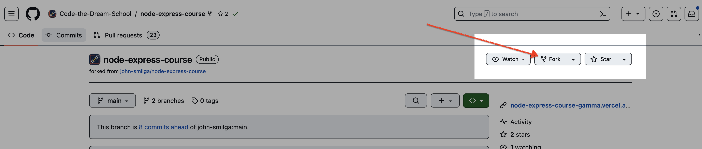
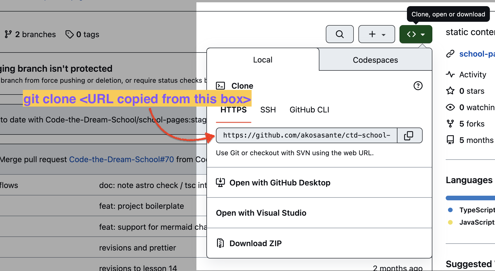

You should already have done the steps described in the **[Getting Started page](./getting-started-with-node-development.md)**. That page describes how to get git, the VSCode Editor, Node, and Postman all installed. All of those should be installed before you start this lesson.

The next step is to create a “fork” of your starter repository for this lesson, which is found **[here](https://github.com/Code-the-Dream-School/node-express-course)**. The fork button is on the upper right of that page. Once the fork is complete, you must `git clone` your fork to get the repository files onto your computer.

Careful!

Please **don’t clone the original Code-the-Dream repository**,  
as if you do that, you will not be able to push your work to Github.





You will do all of your work inside the directory created by the `git clone` command. By default, this directory will be called “node-express-course”. Change directories so that you are inside that directory. Then create the **branch** for this week, using the command `git checkout -b week1`.

Now change the directory to the one that says `01-node-tutorial/answers`. You’ll do all of this week’s work inside this directory.

Create the following programs for this lesson, all within the “answers” directory. By the way, there are examples of each of the programs you need to create in the 01-node-tutorial directory (in case you get stuck) but try to do your own work. If you need to review a section of the video for any of these exercises, view the video within Youtube, but not in full screen mode. The panel on the right will show you the chapter of the video so that you know what you should review.

Your homework should include the following programs:

1. `01-intro.js`: This program should use the `console.log` function to write something to the screen. While you are in the “answers” directory, run the command, `node 01-intro.js`, to verify that the program runs. You can also put additional JavaScript logic in your program.
2. `02-globals.js`: This program should use the `console.log` function to write some globals to the screen. Set an environment variable with the following command in your command line terminal: `export MY_VAR="Hi there!"` The program should then use `console.log` to print out the values of `__dirname` (a Node global variable) and `process.env.MY_VAR` (`process` is also a global, and contains the environment variables you set in your terminal.) You could print out other globals as well ([Node documentation](https://nodejs.org/api/globals.html#global-objects) on available globals). For each of these programs, you invoke them with `node` to make sure they work.
3. For the next part, you will write multiple programs. `04-names.js`, `05-utils.js`, `06-alternative-flavor.js`, and `07-mind-grenade.js` are modules that you load, using require statements, from the `03-modules.js` file, which is the main program. Remember that you must give the path name in your require statement, for example:

```javascript
const names = require("./04-names.js");
```

(3a). `04-names.js` should export multiple values in an object that you will require in `03-module.js`.

(3b). `05-utils.js` should export a single value, which is a function you will call in `03-modules.js`.

(3c). `06-alternative-flavor.js` should export multiple values in the module.exports object, but it should use the alternative approach, adding each value one at a time. The exported values from each should be used in `03-modules.js`, logging results to the console so that you know it is working.

(3d). `07-mind-grenade.js` may not export anything, but it should contain a function that logs something to the console. You should then call that function within the code of `07-mind-grenade.js`. This is to demonstrate that when a module is loaded with a require statement, anything in the mainline code of the loaded module runs.  
**NOTE**: The only program you should need to actually invoke to test that everything is working is `03-modules.js`, because it loads all the others (files 4-7).

1. `08-os-module.js`: This should load the built-in `os` Node module and display some interesting information from the resulting object. As for all modules, you load a reference to it with a require statement, in this case

```javascript
const os = require("os");
```

You can look **[here](https://nodejs.org/api/os.html)** for documentation on the stuff in the built-in os module.

1. `09-path-module.js`: This should load the `path` Node module, which is another built-in module. It should then call the `path.join` function to join up a sequence of alphanumeric strings, and it should print out the result. The result will work one way on Windows, where the directory separator is a backslash, and a different way on other platforms, where the directory separator is a slash.

```
# Example of a Windows path:
C:\Users\JohnSmith\node-express-course\01-node-tutorial\answers

# Exmaple of a Mac or Linux path:
/Users/JohnSmith/node-express-course/01-node-tutorial/answers
```

1. `10-fs-sync.js`: This should load `writeFileSync` and `readFileSync` functions from the `fs` module. Then you will use `writeFileSync` to write 3 lines to a file, `./temporary/fileA.txt`, using the `"append"` flag for each line after the first one. Then use `readFileSync` to read the file, and log the contents to the console. Be sure you create the file in the `temporary` directory. That will ensure that it isn’t pushed to Github when you submit your answers (because that file has been added to the `.gitignore` file for you already which tells git not to look at those files).
2. `11-fs-async.js`: This should load the `fs` module, and use the asynchronous function `writeFile` to write 3 lines to a file, `./temporary/fileB.txt`. Now, be careful here! This is our first use of **asynchronous functions** in this class, but we are going to use them a lot! First, you need to use the `"append"` flag for all but the first line. Second, each time you write a line to the file, you need to have a callback, because the `writeFile` operation is asynchronous. Third, for each line you write, you need to do the write for the line that follows it within the callback – otherwise the operations won’t happen in order. Put `console.log` statements at various points in your code to tell you when each step completes. Then run the code. Do the console log statements appear in the order you expect? Run the program several times and verify that the file is created correctly. Here is how you might start:

```javascript
const { writeFile } = require("fs");
console.log("at start");
writeFile("./temporary/output.txt", "This is line 1\n", (err, result) => {
  console.log("at point 1");
  if (err) {
    console.log("This error happened: ", err);
  } else {
    // here you write your next line
  }
});
console.log("at end");
```

To get the lines to be written in order, you end up with a long chain of callbacks, which is called “callback hell”. We’ll learn a better way to do this soon.

1. `12-http.js`. This program should use the built-in `http` module to create a simple web server that listens on port 3000\. This is done with the `createServer` function. You pass it a callback function that checks the request variable (`req`) for the current `url` property, and depending on what the URL is, sends back a message to the browser screen. Then have your code listen on port 3000, run this file with the `node` command, and test it from your browser, by navigating to `http://localhost:3000`. You can look at `12-http.js` for the instructor’s answer (except that program listens on 5000). You will need to type in Ctrl+c (the Ctrl key plus the letter “C” at the same time; or for Mac the Cmd key plus the letter “C” at the same time) to exit your program.
2. Within your “answers” directory is a program called `prompter.js`. This is a program for a simple server. Try it out! It will display a form in the browser when you run the file and navigate to `http://localhost:3000`. Then, when the user submits the form, it echoes back what was submitted, and displays the form again. You don’t have to worry about how it works. There is a simple body parser to read any values submitted with the form, and that parser returns a hash with the name and value of each. Because the parser is asynchronous, you get back the hash in a callback.  
Now, your task is to change this program so that it does something interesting! First, you can change the variables that you want to store when you get the form back. Then, you can change the form itself to return the values you want from the user, which you store in those variables. Then, you can use string interpolation to insert the values of your variables into the HTML. Finally, you change the logic that handles the hash of values you get when the user submits the form, so that you save the values the user submits. The places you would change are marked in the code.  
For example, you could change the input field to be a dropdown with various colors, and you could set the background color of the body to be what the user chooses. Or, you could make a number guessing game: Start with a random number from 1 to 100, let the user guess, and tell the user if their guess is low or high. In this case, you’d change the input field so that it accepts only numeric input (but when it is returned in the hash, it will be a string, so you’d have to convert it.)

When you are done, change directories to the `01-node-tutorial` folder and then do the following to submit your work:

```
git commit add ./answers
git commit -m "answers for lesson 1"
git push -u origin week1
```

Then go to your GitHub repository – the one you created with a fork (the URL should have your Github username in it). Create a pull request. You may see a yellow banner on your repository if you recently pushed your change, where you can click the “Compare & pull request” to create a PR. Otherwise, you can switch to your branch in the dropdown on the repo page, and then click the pull request icon to create a PR that way.

Careful!

The target of the pull request should be the main branch of the repository  
you created when you forked —  
**not the Code-the-Dream-School main branch!**

Once you have created the pull request, you can copy the URL to link the pull request in your homework submission form. The homework submission form is on the main page for this lesson. This will be the general procedure for submitting homework for this course.

<video title="Open a PR walkthrough" src="./images/submit-pr.mp4" controls="controls" width="300" height="150"></video>

When you submit your homework, you also submit your answers to the mindset assignment, if there is one for that lesson.


### Mindset Assignment
Information Literacy / AI continued

Have you ever gotten advice from someone, that turned out to be wrong, perhaps bad advice or just not applicable to you? The internet is a powerful tool to provide information to the masses, but there isn’t anything in place that regulates whether that information is accurate, and it isn’t always immediately apparent when information is or is not applicable to what you’re experiencing. As developers you’ll rely on the internet a lot, but that doesn’t mean all the answers you find will be correct, the best solution, or helpful.

Information literacy is the ability to identify, find, evaluate, and use information effectively. In technology, this often translates not only to assessing the accuracy of answers but also how to find a solution that aligns with your project specifications (ex. Did you find an article with a solution to your problem, but the solution is for someone using a different version of Ruby or NPM?) The specs may not always be a perfect match, but could still shed light on a shared root cause.

Some helpful tools that equip you to have stronger information literacy are:

ALWAYS check date of article or posting, especially with StackOverflow - versions and problems rapidly change in the world of tech. The first thing you should always verify is the WHEN, when was this information posted.

Know your own specifications (what tools + versions you’re using) so you can be critical about the answers you read.
Is this information “from the source” (official developer documentation) or second hand (a tutorial or blog post)? The latter may warrant some additional skepticism—when in doubt start with the source, and then look to secondary resources to supplement.
Is this a site you trust and has helped you before reliably? Navigating information sources takes time to get the hang of, so incorporate some of the tools we’ve covered earlier regarding asking for help, debugging, being curious and willing to try new things, and being ok with not knowing the answer at first!

Lastly, referring to Documentation (directly from whatever technology you are using) should always be your go to when applicable. Documentation will always provide you accurate information.  

Please answer the below prompts in your assignment submission:

When was a time you got misinformation or bad advice? What happened? Also consider any time an artificial intelligence tool has given you bad/weird answers. Share about that experience here.
What are some ‘clues’ that you use to help you assess whether a resource is applicable/trustworthy or not? What are some ways you can verify the information you got from AI was accurate/current?
What are some ways you’ll build on your information literacy either in your personal life or as a developer?
