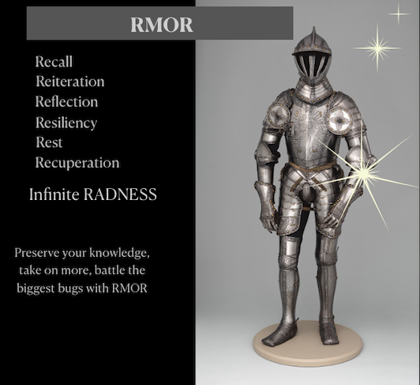

Rmor reviews previous weeks materials. 
Don't worry it's not a proper test/quiz.
You can submit more than once.
Here are the questions to expect ahead of time: 

1. What is the primary purpose of middleware in Express? 

a) To handle HTTP requests and responses directly
b) To provide a way to modularize code into smaller components
c) To modify or process requests before they reach the route handler
d) To connect to a database

When refactoring an Express application, what is the main benefit of splitting code into router and controller modules?

A) Increased security
B) Improved performance
C) Enhanced code organization and maintainability
D) Simplified database access

3. In which of the following scenarios would you use middleware in an Express application? (Select all that apply)

a) To log incoming request details
b) To handle errors in route handlers
c) To validate request data before reaching the route handler
d) To dynamically generate HTML content based on request parameters

4. Which patterns are commonly used for refactoring Express applications into router and controller modules? (Select all that apply)

a) Defining routes directly in the app.js file
b) Creating separate router modules for different resources
c) Implementing controllers to handle business logic separately from routes
d) Using middleware to manage routing logic

5. What are the benefits of using express.Router() to organize routes? (Select all that apply)

a) It allows you to define routes in separate files, improving code organization
b) It automatically handles database connections
c) It provides a way to modularize route definitions and middleware
d) It integrates with external APIs directly

6. In terms of an application, what is scalability? (Written response and speak this question aloud as if interviewing)

7. Explain how you would structure an Express application to ensure scalability when dealing with a growing number of routes and middleware. Discuss the roles of router modules, controller modules, and middleware in your approach. (Written response and speak this question aloud as if interviewing)
